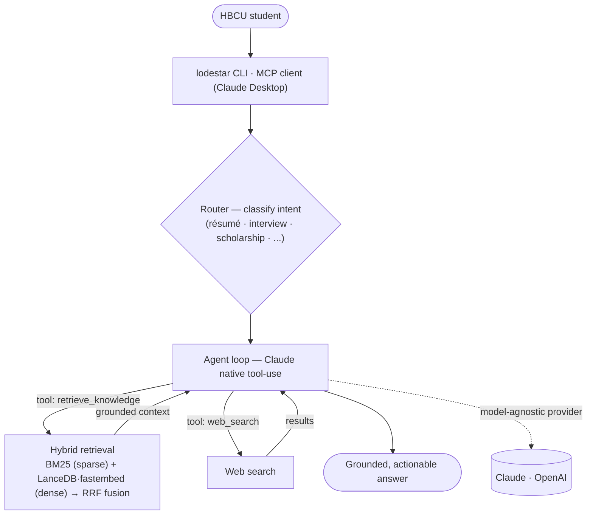

# Lodestar 🧭

> **A 2026 agentic, retrieval-grounded AI career assistant for HBCU students** — model-agnostic
> (Claude by default), with hybrid RAG and a Model Context Protocol server. Evolved from
> **IgniteAI**, the ChatGPT custom GPT my team built and took to **🥇 first place at the HP
> Future of Work Accelerator 2024** (HBCU Technology Conference).

[](https://github.com/wolfieman/lodestar/actions/workflows/ci.yml)


---

> **At a glance:** model-agnostic LLM layer (Claude · OpenAI) · **hybrid RAG** (BM25 + LanceDB
> vectors, fused with RRF) · **agentic** tool-use (router → tool loop) · exposed as an **MCP
> server** for Claude Desktop · **LLM-as-judge** evals · OWASP/FERPA guardrails · 33 tests ·
> ruff-clean · Python 3.14 / uv · runs fully offline in test mode

## TL;DR

In 2024, my HP FOWA team built **IgniteAI** — a ChatGPT custom GPT that coaches HBCU students on
résumés, interviews, internships, and scholarships — and **won first place**. In 2026 I rebuilt it
as **Lodestar**: a real, runnable **agentic RAG** system that *decides when to retrieve*, grounds
its answers in a knowledge base, runs **model-agnostic** (default Claude), and plugs into Claude
Desktop as an **MCP server**. This repo ships both — the modern rebuild **and** a faithful
reproduction of the original — side by side, so the 2024 → 2026 evolution is visible in one place.

## Architecture



The same engine is exposed two ways: a **CLI** (`uv run lodestar`) and an **MCP server**
(`uv run python -m lodestar.mcp_server`) that registers `retrieve_knowledge` + `get_career_advice`
tools into Claude Desktop. With `TEST_MODE=true` everything runs offline (mock model + deterministic
embeddings) — no key required.

## See it work

<details open>
<summary><b>Live Claude run — “How do I find scholarships for HBCU STEM students?”</b></summary>

```text
$ uv run lodestar          # TEST_MODE=false, ANTHROPIC_API_KEY set
Lodestar (agentic) — live (claude-sonnet-4-6). Type 'quit' to exit.

You: How do I find scholarships for HBCU STEM students? Give 2-3 concrete next steps.

Lodestar:
## 🎓 Finding Scholarships as an HBCU STEM Student

### Where to Look — real programs to target
| Organization | What they offer |
|---|---|
| UNCF (United Negro College Fund) | STEM-focused scholarships — uncf.org/scholarships |
| Thurgood Marshall College Fund   | Awards for HBCU students, incl. STEM — tmcf.org |
| NSBE, SMART (DoD), NSF S-STEM     | Society + federal STEM funding pipelines |

### Your next steps
1. Build a one-page tracker (deadline · GPA · essays · recommenders).
2. Apply to 2–3 per week; ask your department chair about named/funded research.
3. Start with UNCF + TMCF this week — they cover the widest set of HBCU STEM awards.
```
*(The agent routed the question, called `retrieve_knowledge`, grounded on the knowledge base,
and synthesized this with `claude-sonnet-4-6`. Generate your own recording — see
[`docs/media-guide.md`](docs/media-guide.md).)*
</details>

## What's inside

| Capability | How it's built |
|---|---|
| **Model-agnostic LLM** | `LLMProvider` interface + `AnthropicProvider` (default, Claude, prompt-caching), optional `OpenAIProvider`, offline `MockProvider` |
| **Hybrid RAG** | `fastembed` dense embeddings in a **LanceDB** vector store + **BM25** sparse, fused via **Reciprocal Rank Fusion** (`retrieval/`) |
| **Agentic tool-use** | keyword **router** → Claude **native tool-use loop** with `retrieve_knowledge` + `web_search` (`agents/`) |
| **MCP server** | `FastMCP` server exposing Lodestar's tools to Claude Desktop / any MCP client (`mcp_server.py`) |
| **Evals** | **LLM-as-judge** harness scoring relevance/accuracy/actionability/safety (`evals/`) |
| **Security** | OWASP-LLM-Top-10 mapping, prompt-injection guardrail, PII detection (`safety.py`, `docs/security.md`) |
| **Resilience** | graceful **BM25 fallback** if the embedding model can't be fetched; full **offline test mode** |

## The two tracks (one repo)

| | Package | What it is | Run it |
|---|---|---|---|
| **Lodestar** (2026) | `src/lodestar/` | the modern agentic-RAG + MCP rebuild | `uv run lodestar` |
| **IgniteAI** (2024) | `src/ignite/` | faithful reproduction of the first-place custom GPT (OpenAI `gpt-4o-mini`) | `uv run ignite` |

Both are **clean-room** — written fresh from the team's architecture docs + the IgniteAI
specification, not the original GPL-3.0 team code (see [`docs/decisions.md`](docs/decisions.md)).
The original product spec is preserved in [`product/`](product/).

## Quickstart

```bash
uv sync --extra dev      # create env + install deps (Python 3.14)
cp .env.example .env      # TEST_MODE=true runs offline; add ANTHROPIC_API_KEY for live Claude

uv run lodestar           # the agentic Lodestar assistant
uv run ignite             # the 2024 IgniteAI reproduction
uv run pytest -m unit      # 33 offline tests
uv run python -m lodestar.mcp_server   # serve over MCP (see docs/mcp.md to wire into Claude Desktop)
```

## Built from a learning plan

Scope was driven by IBM Technology's **"AI Periodic Table"** curriculum — every track maps to
something concrete here: RAG → hybrid retrieval, Agents → the router + tool loop, MCP → the server,
AI Security → the guardrails, Governance → the evals. Full mapping:
[`docs/ibm-curriculum-mapping.md`](docs/ibm-curriculum-mapping.md).

## Tech stack

**Python 3.14** · **uv** (env + lock) · **Anthropic SDK** (Claude, default) · **fastembed** (ONNX
embeddings) · **LanceDB** (vector store) · **rank-bm25** (sparse) · **MCP** Python SDK · **ruff** ·
**pytest** · **cryptography** (Fernet, FERPA demo).

## Repository structure

```
lodestar/
├── src/lodestar/      # 2026 rebuild — providers/ retrieval/ agents/ prompts/ mcp_server.py · CLI: lodestar
├── src/ignite/        # 2024 IgniteAI reproduction · CLI: ignite
├── product/           # IgniteAI custom-GPT spec + knowledge (what shipped in 2024)
├── data/              # sample knowledge base (offline demo/tests)
├── evals/             # LLM-as-judge evaluation harness
├── docs/              # architecture · decisions · roadmap · mcp · security · IBM-curriculum · media-guide
├── competitions/      # HP FOWA 2024 first-place record
├── portfolio/         # case study (problem → solution → contributions → result)
├── assets/            # README media (infographic / video / demo GIF)
└── tests/             # unit (offline) + integration (live, auto-skip)
```

### Key documentation

| Doc | What |
|---|---|
| [`docs/roadmap.md`](docs/roadmap.md) | The two-track design |
| [`docs/architecture.md`](docs/architecture.md) | System architecture (the production vision + what's built) |
| [`docs/ibm-curriculum-mapping.md`](docs/ibm-curriculum-mapping.md) | IBM "AI Periodic Table" → code |
| [`docs/mcp.md`](docs/mcp.md) | Wire the MCP server into Claude Desktop |
| [`docs/security.md`](docs/security.md) | OWASP LLM Top-10 + FERPA posture |
| [`docs/decisions.md`](docs/decisions.md) | Clean-room boundary + design decisions |
| [`portfolio/case-study.md`](portfolio/case-study.md) | The HP FOWA story + my contributions |

## Credits & license

**IgniteAI was a team effort** by HP FOWA 2024 Team 4 — see [NOTICE.md](NOTICE.md) for attribution.
This repository (the Lodestar rebuild + the reproduction + all docs) is authored by **Wolfgang
Sanyer** and licensed under the **Polyform Noncommercial License 1.0.0** ([LICENSE](LICENSE)) —
free to view, study, and share for non-commercial purposes.

**Wolfgang Sanyer** · [wolfgang.sanyer@gmail.com](mailto:wolfgang.sanyer@gmail.com)
